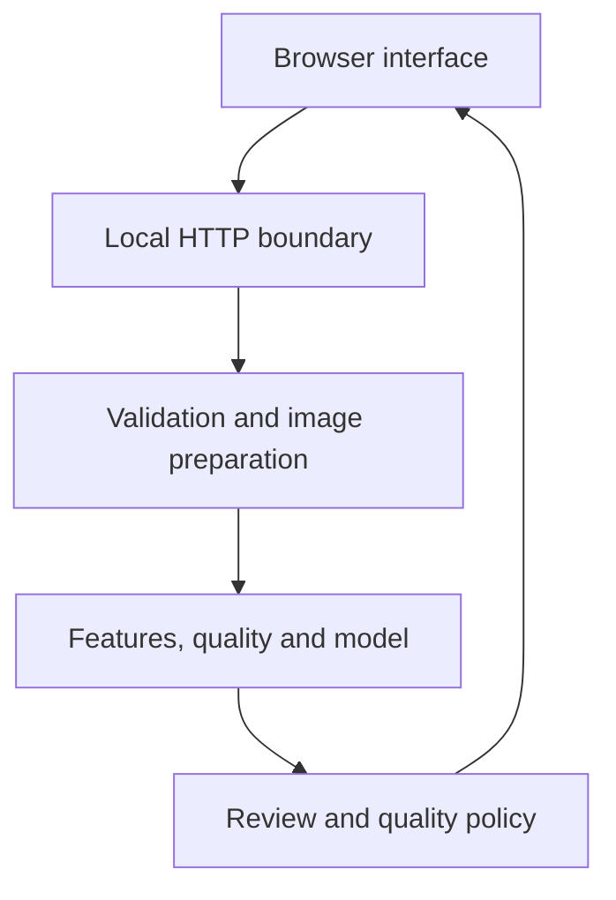

# RetinaTrust architecture

RetinaTrust is a local, single-process research application. The browser interface and Python server communicate only over the loopback interface by default. Uploaded images are processed in memory and are not written to disk.

## Component boundaries

| Component | Files | Responsibility |
|---|---|---|
| Browser interface | `static/index.html`, `static/styles.css`, `static/app.js` | File selection, stress controls, result display, accessibility and scientific wording |
| HTTP boundary | `app.py` | Local endpoints, static files, request validation, response formatting and non-sensitive logging |
| Image pipeline | `retina_poc/core.py` | Image loading, retinal-field preparation, handcrafted features, perturbations and normalization |
| Model and policy | `retina_poc/modeling.py` | Inference, quality scoring, confidence handling, decisions and model metadata |
| Reproduction scripts | `scripts/train_baseline.py`, `scripts/evaluate_robustness.py` | Fixed-split model training, paired robustness experiments and legacy control |
| External validation | `retina_poc/external_validation.py`, `scripts/evaluate_external.py` | Strict DeepDRiD schema parsing, frozen inference, quality-gate metrics and patient-clustered intervals |
| Evidence | `artifacts/v0.3/`, `MODEL_CARD.md`, `EXPERIMENT_RESULTS.md` | Versioned model, per-image results, interpretation and integrity records |
| Protocol evidence | `artifacts/v0.4/`, `docs/EXTERNAL_VALIDATION_PROTOCOL_BG.md` | Pre-result hashes and analysis plan; no external metrics |

## Request path

1. The browser reads a JPEG or PNG as a Data URL.
2. `POST /api/analyze` validates the request before decoding and processing it.
3. The image is canonicalized to a maximum dimension of 1024 px through the same LANCZOS path used for training and clean evaluation.
4. The selected synthetic perturbation is applied; optional normalization follows it.
5. The scientific pipeline extracts 178 deterministic features and technical quality metrics.
6. The calibrated baseline produces a probability for referable DR.
7. The quality and confidence policy returns one of: provisional result, human review or repeat acquisition.
8. The interface displays probability, uncertainty, quality components, policy rationale and the research disclaimer separately.

## Demonstration-image caveat

`GET /api/sample` converts the bundled image to a presentation Data URL with a maximum size of 1100×800 and JPEG quality 88. The API sample therefore does not contain identical pixels to the original 1400×930 file. Both are subsequently canonicalized, but the sample has already undergone an extra JPEG roundtrip. Direct-file and API-sample results must not be presented as an old/new A/B comparison.

A valid regression test creates one encoded request body and sends those exact bytes through both implementations in the same environment.

## Trust and safety boundaries

- The server binds to `127.0.0.1` by default.
- No upload persistence, external API call or telemetry is required.
- Request bodies and image data must never be logged.
- Joblib artifacts are executable Python serialization; only the verified bundled artifact should be loaded.
- The output is a research result, not a diagnosis, clinical recommendation or medical-device claim.

## Scientific invariants

The fixed official test partition, feature schema, canonical transform, trained artifact, thresholds and reported metrics are versioned evidence. The test partition was reused after v0.1 protocol review and is not pristine. Changes require a separate scientific review, reproducible commands, new artifact hashes and explicit documentation in `CHANGELOG.md`.

## External-validation boundary

The external runner is offline and separate from the browser API. It accepts only the known DeepDRiD training/validation directory layout, validates the official CSV schema, and stops on missing or inconsistent rows. It does not tune the model. The protocol lock hashes the model and every scientific code path used by the run before any external result is accepted.
